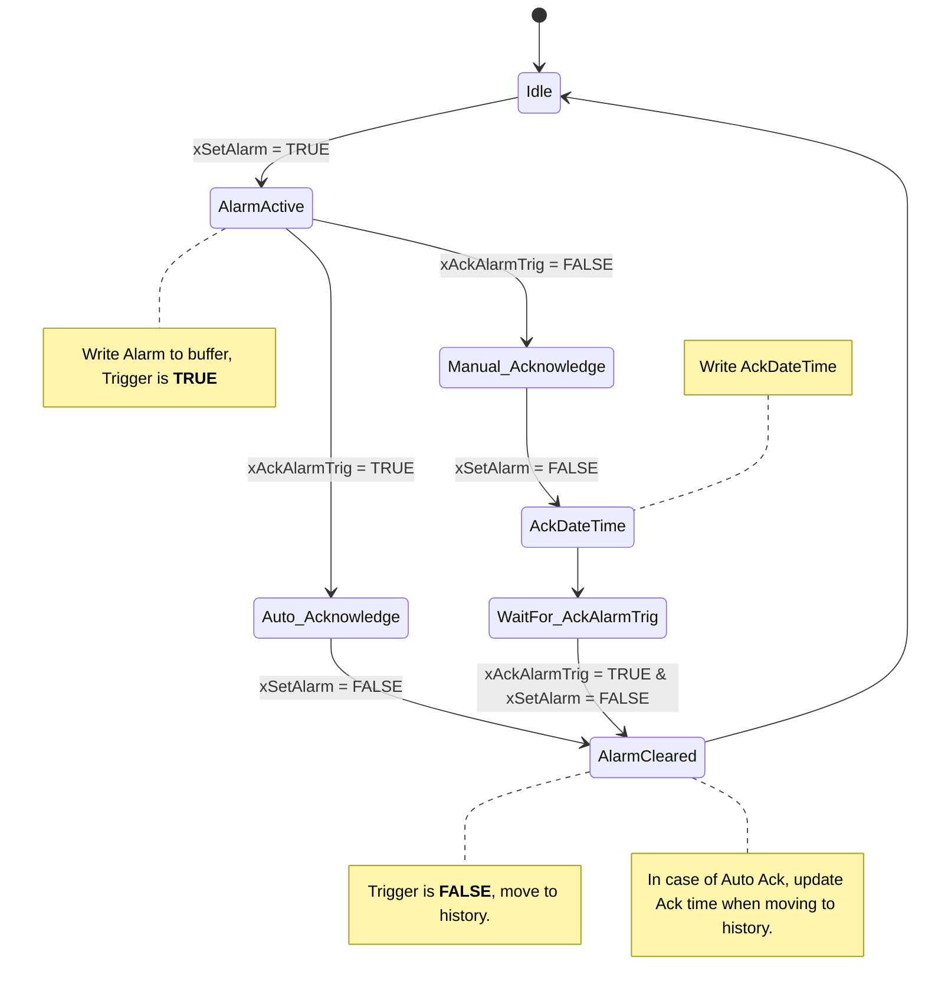

# Comportement des alarmes

## Cas automatique
Sélectionné par défaut avec ``bAckAlarmTrig = TRUE``. 

```iecst
VAR_INPUT
    // Active on state
    xSetAlarm       : BOOL := FALSE;
    // Active on rising edge
    xAckAlarmTrig   : BOOL := TRUE;
END_VAR

```

L'entrée ``xAckAlarmTrig`` est ignorée car il n'est pas possible de supprimer une alarme pour laquelle la condition initiale, par exemple: **"Moteur trop chaud"**, est encore présente.

Dans ce cas, aussitôt que l'alarme disparait, le trigger passe à ``FALSE`` et la sortie ``AckDateTime`` prend la date qui correspond au moment où ``bSetAlarm`` passe de ``TRUE`` à ``FALSE``.

Quand le résultat de l'alarme, ``Trigger``, disparait, l'alarme est retirée du tableau des alarmes, ``Alarm``, pour passer dans l'historique des alarmes, ``AlarmHistory``.

Note: Quand bSetAlarm est activé, passage de ``FALSE`` à ``TRUE``, si ``xAckAlarmTrig`` est TRUE, alors on est dans le cas automatique et la variable de **sortie** ``xAutoAcknowledge`` est activée à ``TRUE``.

## Cas manuel
Sélectionné par défaut avec ``xAckAlarmTrig = FALSE``, quand ``xSetAlarm`` est ``FALSE``.

Dans ce cas, au moment ou l'alarme est activée, la sortie ``xAutoAcknowledge`` est mise à ``FALSE``.

Cela implique que pour désactiver l'alarme, même quand xSetAlarm est FALSE, il faut un passage de ``xAckAlarmTrig`` de ``FALSE`` à ``TRUE`` pour que le ``Trigger`` revienne à ``FALSE``.

## Remarque à propos de Trigger 
``UnitName.Admin.Alarm[#].Trigger``
Selon la norme, Trigger ne peut pas être TRUE quand il est dans la liste des alarmes.

Trigger n'est pas uniquement lié à l'entrée bSetAlarm, puisque en cas de configuration manuelle, xAckAlarmTrig = FALSE au moment de l'alarme, le Trigger ne sera ramené à FALSE que par l'action R_TRIG de FALSE à TRUE.

### Partial state diagram for overview.


<div style="color: red; font-weight: bold; font-size: 1.5em;">
    On ne peut pas faire disparaitre une alarme encore active.
</div>

C'est pourquoi, on ne peut pas faire un Acknowledge d'une alarme: *tant qu'il n'y a pas une date de fin*.

C'est ce qui permet de faire la différence à l'écran entre une alarme avec ou sans Auto-Ack. Si il y a une date de Acknowledge, c'est que il faut la quittancer pour qu'elle disparaisse.

Soit via le bouton reset, soit via une information envoyée via 

Complete state diagram

## Rôle de FB_HEVS_StopReason
Voir ``StopReasonCntrlCmd := fbStopReason.stopReasonToMaster,``

```iecst
fbPackMaster(Enable := TRUE,
             // Inputs
             SC_StateComplete := whatSC AND testOtherSC,
             Command_CmdChangeRequest := PackTag.Command.CmdChangeRequest,
             Command_CntrlCmd := PackTag.Command.CntrlCmd,
             // Get Stop reason if needed
             StopReasonCntrlCmd := fbStopReason.stopReasonToMaster,
             Admin_CurDisabledStates := PackTag.Admin.CurDisabledStates,
             // Outputs
             Status_StateCurrent => PackTag.Status.StateCurrent,
             Status_StateChangeInProcess => PackTag.Status.StateChangeInProcess,
             Status_StateRequested => PackTag.Status.StateRequested,
             // To help diagnostic and UI
             strState => PackTag.hevsUI.uiStateMasterCurrent,
             strDiagnostic	=> PackTag.hevsUI.uiStateMasterDiagnostic);
```

C'est cette commande qui permet de récupérer une alarme depuis le PackTag pour générer un événement.

