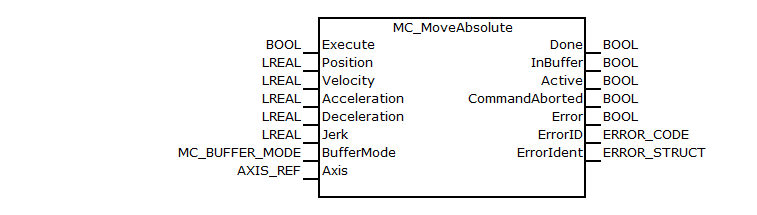
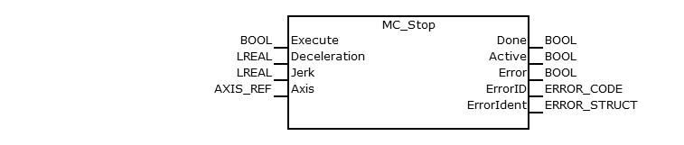

<h1 align="left">
  <br>
  
  <br>
  Industrial Automation Base
  <br>
</h1>

Course AutB

Author: [Cédric Lenoir](mailto:cedric.lenoir@hevs.ch)

# MC_Stop & MC_MoveAbsolute

- [AXIS_REF](#axis_ref)
- [MC_MoveAbsolute](#mc_moveabsolute)
- [MC_Stop](#mc_stop)

## AXIS_REF
Typically, we have a **VAR_IN_OUT** access type that provides each Function Block with an axis referenced in the Motion Control kernel.

In our system, we use a specific function that retrieves the reference to the structure for **AXIS_REF**.

See ``GVL_AxisDefines``.

```iecst
VAR_GLOBAL
	  X_Axis: MB_AXISIF_REF :=(AxisName:='Axis_1',AxisNo:=1);
	  Y_Axis: MB_AXISIF_REF :=(AxisName:='Axis_2',AxisNo:=2);
	  Z_Axis: MB_AXISIF_REF :=(AxisName:='Axis_3',AxisNo:=3);
END_VAR
```

> ``Axis_1`` refers to an axis defined in the NC kernel of the ctrlX Core.

This is the ``X_Axis`` variable, which is required when calling a Motion Control FB, for example, for ``MC_Stop`` or MC_MoveAbsolute:

```iecst

mcStop(Axis := GVL_AxisDefines.X_Axis,
       Deceleration := 1,
       Execute := stPlcOpenFbs.xStop);

mcMoveAbs(Axis := GVL_AxisDefines.X_Axis,
          Position := 55,
          Velocity := 0.1,
          Execute := stPlcOpenFbs.xStartMotionOne);
```

## MC_MoveAbsolute
### Short description
This Function Block commands a controlled motion to a specified absolute position.

<figure>
    
    <figcaption>MC_MoveAbsolute, source: Bosch Rexroth</figcaption>
</figure>

### Functional description
Prerequisite: The axis has to be in a powered state by **MC_Power**.

During the movement, the PLCopen state of the axis is set to DISCRETE_MOTION.
When the commanded target position is reached, the function block is set to state Done and the PLCopen state of the corresponding axis is set to **STANDSTILL**.

You can use **MC_ReadStatus** to determine the current state.

In case an error occurred before execution (e.g. violated dynamic limits, invalid command parameters) the function block will be set to state ``Error``.
In case an error occurred during execution, the axis state is set to **ERRORSTOP**.

If the function block is set as a ``mcAborting`` mode, all previous commands are discarded and the currently executed commanded will be interrupted.
In this case, the axis will still move continuously (within its new commanded dynamic limits) towards the new target position.

If the function block is set as a ``mcBuffered`` mode, this command will be buffered until all previous commands are executed done and the currently executed commanded will not be interrupted.
In this case, the axis will still move to velocity-zero and then move (within its new commanded dynamic limits) towards the new target position.

If the function block is interrupted by another function block which is set as ``mcAborting`` mode or **MC_STOP**, it will be set to state ``CommandAborted``.

If the function block works in ``Active`` state. It means current function block is executed

### Possible error codes
The function block uses the CXA_TABLE, refer to CXA_Commontypes.ERROR_TABLE

Error detail information please see CXA_MOTION_ERR.

|Scope      |Name        |Type   |Comment    |
|-----------|------------|-------|-----------|
|VAR_INPUT  |``Execute``     |BOOL   |Start the motion at rising edge|
|VAR_INPUT  |``Position``    |LREAL  |Commanded ``Position`` for the motion, *in technical unit* ``[u]``, negative or positive|
|VAR_INPUT  |``Velocity``    |LREAL  |Value of the maximum ``Velocity``, *not necessarily reached* ``[u/s]``.|
|VAR_INPUT  |``Acceleration``|LREAL  |Value of the ‘Acceleration’, always positive, *increasing energy of the motor* ``[u/s2]``|
|VAR_INPUT  |``Deceleration``|LREAL  |Value of the ‘Deceleration’, always positive, *decreasing energy of the motor* ``[u/s2]``|
|VAR_INPUT  |``Jerk``        |LREAL  |Value of ‘jerk’ (always positive) [u/s3]|
|VAR_INPUT  |``BufferMode``  |MC_BUFFER_MODE  |defines this FB execute immediately or push into the buffer|
|VAR_OUTPUT |``Done``        |BOOL   |Commanded position finally reached|
|VAR_OUTPUT |``InBuffer``      |BOOL   |Command is queued and to be executed.|
|VAR_OUTPUT |``Active``      |BOOL   |Execution in progress|
|VAR_OUTPUT |``CommandAborted``|BOOL   |``Command`` is aborted by another command|
|VAR_OUTPUT |``Error``       |BOOL   |Indicates an error|
|VAR_OUTPUT |``ErrorID``     |ERROR_CODE|Class of error|
|VAR_OUTPUT |``ErrorIdent``  |ERROR_STRUCT |Detailed information about error|
|VAR_IN_OUT |``Axis``        |AXIS_REF     |Reference to the axis ``CONST``|

## MC_Stop
### Short description
This function block generates a slowdown, **within the given dynamic limits**, until the axis is stopped, **velocity zero**.

<figure>
    
    <figcaption>MC_Stop, source: Bosch Rexroth</figcaption>
</figure>

### Functional description
During slowdown, the axis in state of **STOPPING**.

After the axis is stopped, the output Done is set and the PLCopen statemachine of the corresponding axis is set to state **STANDSTILL**.

This function block abort any ongoing function block execution. When **STANDSTILL** is reached the position is kept active.
### Possible error codes
The function block uses the CXA_TABLE, refer to CXA_Commontypes.ERROR_TABLE

Error detail information please see CXA_MOTION_ERR.

|Scope      |Name        |Type   |Comment    |
|-----------|------------|-------|-----------|
|VAR_INPUT  |``Execute``     |BOOL   |Start the action at rising edge|
|VAR_INPUT  |``Deceleration``|LREAL  |Value of *deceleration*, always positive, ``[u/s2]``|
|VAR_INPUT  |``Jerk``        |LREAL  |Value of ‘jerk’ (always positive) [u/s3]|
|VAR_OUTPUT |``Done``        |BOOL   |Execution finished|
|VAR_OUTPUT |``Active``      |BOOL   |Execution in progress|
|VAR_OUTPUT |``Error``       |BOOL   |Indicates an error|
|VAR_OUTPUT |``ErrorID``     |ERROR_CODE|Class of error|
|VAR_OUTPUT |``ErrorIdent``  |ERROR_STRUCT |Detailed information about error|
|VAR_IN_OUT |``Axis``        |AXIS_REF     |Reference to the axis ``CONST``|