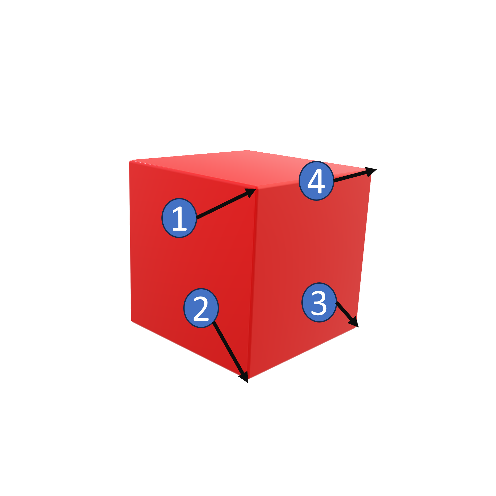

<h1 align="left">
  <br>
  
  <br>
  Industrial Automation Base
  <br>
</h1>

Course AutB

Author: [Cédric Lenoir](mailto:cedric.lenoir@hevs.ch)

# LAB 06 Pack & PLCopen

## Ziel der praktischen Arbeit
- [ ] Verwendung von PLCopen-Funktionsbausteinen im PackML-Kontext
- [ ] Implementierung von Alarmen und Warnungen zur Systemüberwachung.

## Programmierregeln
- Sie dürfen ausschließlich mit **PRG_Student** arbeiten.
- **PRG_Student** ist ein Modul unter anderen.
- Die Achsmodule dienen der Steuerung der Motordrehmomentanwendung; umgekehrt ist dies nicht erforderlich.
-  Ein kurzer Überblick über [FB_Stop](MC_MoveAbsolute_AND_MC_Stop.md) et [FB_MoveAbsolute](MC_MoveAbsolute_AND_MC_Stop.md).
-  [Documentation](#documentation).

### Sicherheit
Die Z-Achse ist so konzipiert, dass sie während der Rücksetzphase zurückgesetzt wird, um Absturzrisiken zu vermeiden.

Beispiel: **FB_ModuleAxis_Z** verwendet **ACT_Resetting**

```iecst
(*
    Manage Resetting
*)
IF actualState = E_PackState.eResetting THEN
   // Set to TRUE if no action requested
   CASE axisResetting OF
      E_AxisResetting.eIdle :
         // For Z axis, position 0 is safe
         mcMoveAbs.Position := 0;
         axisResetting := E_AxisResetting.eMotionResetPos;
        
      E_AxisResetting.eMotionResetPos :
         IF mcMoveAbs.Done THEN
            axisResetting := E_AxisResetting.eMotionIdleDone;
         ELSIF mcMoveAbs.Error THEN
            axisResetting := E_AxisResetting.eMotionIdleError;
         END_IF
      E_AxisResetting.eMotionIdleDone :
         // Do Nothing, SC
         ;
      E_AxisResetting.eMotionIdleError :
         // Do nothing, wait for debug
         ;		
   END_CASE
    
   stActing.Resetting_SC := (axisResetting = E_AxisResetting.eMotionIdleDone);
ELSE
   axisResetting := E_AxisResetting.eIdle;	
   stActing.Resetting_SC := FALSE;
END_IF

```

Der mcMoveAbs-FB wird außerhalb der State Machine aufgerufen, sodass er immer aufgerufen wird und nicht in einem unbestimmten Zustand verbleibt.

```iecst
mcMoveAbs.Execute := (axisExecute = E_AxisExecute.eSetAbsolutePosition) OR
                     (axisResetting = E_AxisResetting.eMotionResetPos) 	OR
                     (axisStarting = E_AxisStarting.eMotionStarting);

```

Sie können denselben FB **MC_MoveAbsolute** wiederverwenden, jedoch mit einer neuen Instanz, z. B. **mcMyMove**.

### Reservierter Zustand
Der Ausführungszustand im manuellen Modus ist für eine Tippaktivität reserviert.
Sie können die anderen Zustände und Modi verwenden.

### HEVS PackML-Prinzip
Das HEVS-Pack verwaltet Zustände automatisch.
**ACT_PackManager** ist für die Modulverwaltung reserviert.

Sie codieren nur die Aktionen der erforderlichen Zustände, hauptsächlich in **Pack_Execute**.


### Implémentation des alarmes et des warnings
Vous appelez vos Warnings et Alarms dans **ACT_WarningAndAlarms**. Voir ci-dessous dans [documentation](#documentation) les exemples de code.

### A propos du Gripper
Le gripper est programmé pour être pilotable manuellement, sauf dans les conditions suivantes:

```iecst
IF NOT ((PackTag.hevsUI.uiStateExecute AND (PackTag.Status.UnitModeCurrent = E_PackModes.Production)) OR
         PackTag.hevsUI.uiStateClearing  OR
         PackTag.hevsUI.uiStateResetting)    THEN
    fbOpenGripper.Execute := stTestFbGripperHmi.openGripper;
    fbCloseGripper.Execute := stTestFbGripperHmi.closeGripper;	
END_IF

```
Das bedeutet, dass beide Funktionsbausteine ​​in allen anderen Zuständen verwendet werden können.

## URS-Benutzeranforderungsspezifikation

|URS ID |Specification|
|-------|-------------|
|0. |**Starting**|
|0.1 |In diesem Zustand werden die X- und Z-Achsen bei **X = -100** und **Z = 100** positioniert.|
|0.2 |Wenn beide Achsen in Position sind, wechseln wir zu „Ausführen“.|
|1. |**Execute**|
|1.1 |Die X- und Z-Achsen müssen sich gemäß Tabelle und [Zeichnung unten](#details-for-square) bewegen.|
|1.2. |Geschwindigkeit, Beschleunigung und Ruck können über die Bedienoberfläche (HMI) variiert werden.|
|1.3. |Der Greifer wird gemäß [Tabelle unten](#details-for-square) aktiviert.|
|1.4. |Die Bewegung wird in einer Schleife fortgesetzt: 1-2-3-5-1...|
|2. |**Hold**|
|2.1 |Wird die Schaltfläche Halten auf der Node-RED-Bedienoberfläche UI gedrückt, werden die Achsen sofort mit dem Befehl FB_Stop gestoppt.|
|2.2 |Wird die Schaltfläche Unhold auf der Node-RED-Bedienoberfläche UI gedrückt, startet das System die Ausführungssequenz neu.|
|3. |**Suspend**|
|3.1. |Nach drei Bewegungszyklen wird das Programm für drei Sekunden unterbrochen, anschließend für drei weitere Zyklen neu gestartet usw.|
|3.2. |Die Unterbrechung muss durch einen Unterbrechungsalarm ausgelöst werden.|
|4. |**Warning**|
|4.1. |Im Zustand „Abgebrochen“ bedeutet dies, dass zum Starten eine Löschung erforderlich ist.|
|4.2. |Im Zustand „Gestoppt“ bedeutet dies, dass zum Starten ein Reset erforderlich ist.|
|4.3. |Im Zustand „Gehalten“ bedeutet dies, dass zum Starten ein Aufheben der Unterbrechung erforderlich ist.|
|5. |**Greiferalarm**|
|5.1. |Wenn die Druckluft abgeschaltet wird und der Greifer nicht schließt, wird ein Stoppalarm mit einer Meldung generiert.|
|5.2. |Wenn die Druckluft abgeschaltet wird und der Greifer nicht öffnet, wird ein Stoppalarm mit einer Meldung generiert.|

### Zusätzliche Informationen
Wir können auch Complete testen. Dieser sollte durch einen Reset neu gestartet werden können.


### Details for Square

|Id |Move To Position X|M.T.P Z |Action      |Delay [ms] |Next Id|
|---|------------------|--------|------------|-----------|-------|
|1  |0                 |50      |eOpen       |500        |2      |
|2  |0                 |-50       |eClose      |0          |3      |
|3  |100               |-50       |eOpen       |0          |4      |
|4  |100               |50      |eClose      |0          |1      |
|1  |0                 |50      |eOpen       |500        |2      |

-  Velocity_m_s        := 0.05;
-  Acceleleration_m_s2 := 1;
-  Jerk_m_s3           := 10;

<div style="text-align: center;">
<figure>
    
    <figcaption>2D motion with a square</figcaption>
</figure>
</div>
## Documentation

-   [For Gripper Function Blocks online](FB_Gripper.md)
-   [HEVS PackTag User Interface](HEVS_PackTag_UI.md)
-   [HEVS Alarms](FB_HEVS_SetAlarm.md)
-   [HEVS Warnings](FB_HEVS_SetWarning.md)


### About Programs

In cltrX PLC Engineering

Function blocks for robot are in **HEVS_Robot**.

Manual motions are set in **HEVS_UnitBox** -> **PRG_Process**.

**PRG_Student** is called in **PRG_Process**.

#### About SC State Complete
The synthesis of modules for the process/Unit are here in **ACT_Build_Pack_SC** of the program **PRG_Process**.

```iecst
(*
    This section should group all EM and CM State Complete
    This Unit_SC is used by PLC_PACK to manager
    States SC
*)
xProcess_SC := fbModuleAxis_X.SC AND
               fbModuleAxis_Y.SC AND
               fbModuleAxis_Z.SC AND
               PRG_Student.SC;
```

#### In the task manager
Only one program is in the task manager it calls all other programs of the Unit Box. PRG_UnitBox.

```iecst
(*
    Check and init program
*)
uliLoopUnitBox := uliLoopUnitBox + 1;
IF NOT xInitUnitBox THEN
    xInitUnitBox := TRUE;
END_IF

(*
    Map program
    Specific to this hardware.
    Mainly access to IO via Profinet and S7-1500
*)
PRG_MapBox();

(*
    Device Manager
    Processing of hardware values.
    May include alarms if devices not included in process
    Ideally, Alarms should be only part of EM and CM in PRG_Process 
*)
PRG_DeviceManager();

(*
    Tools for processing
    Include
        Pack States and Modes
        Alarms
        Date and Time
*)
PLC_PACK();
PRG_TestAlarm();
PRG_GetTime_CtrlX();

(*
    Process
    Management of Unit, EM and CM if any
*)
PRG_Process();
```